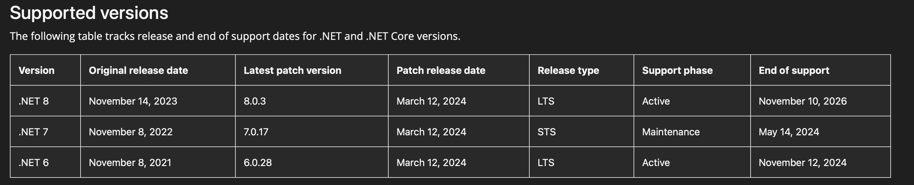
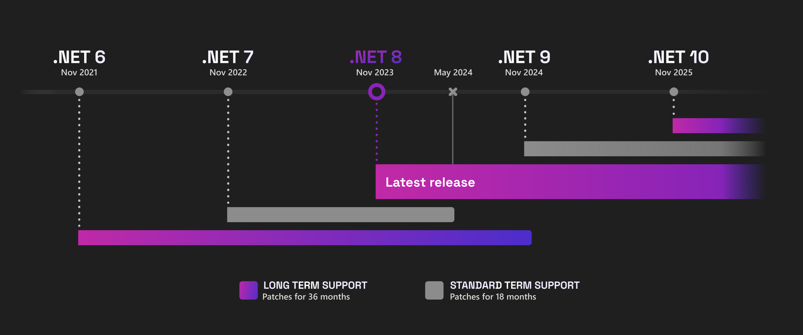

# CV_5_Blazor

# Introduction to .Net :

.NET is a free, open-source developer platform developed by Microsoft, providing a powerful framework for building various types of applications, including web, desktop, mobile, cloud, gaming, and IoT (Internet of Things) applications. It is one of the most widely used frameworks for software development due to its versatility, performance, and robustness.

The .NET platform consists of several key components:

1. **Common Language Runtime (CLR)**: The CLR is the heart of the .NET platform. It provides a runtime environment for executing managed code written in various languages, such as C#, Visual Basic, F#, and more. The CLR manages memory, handles exceptions, and provides various services to applications.

2. **Base Class Library (BCL)**: The BCL is a comprehensive collection of classes, types, and APIs (Application Programming Interfaces) that provide common functionality for .NET applications. It includes classes for working with data, files, networking, security, and much more, making it easier for developers to build robust applications.

3. **Languages**: .NET supports multiple programming languages, allowing developers to choose the language that best fits their needs and preferences. The most commonly used languages for .NET development are C#, Visual Basic, and F#. Each language has its strengths and is suitable for different types of applications.

4. **Development Tools**: Microsoft provides a set of powerful development tools for building .NET applications, including Visual Studio and Visual Studio Code. These IDEs (Integrated Development Environments) offer features like code editing, debugging, profiling, and project management, streamlining the development process.

5. **Cross-Platform Support**: With the introduction of .NET Core (now known as .NET), Microsoft made significant efforts to make the framework cross-platform. This means that .NET applications can run on various operating systems, including Windows, macOS, and Linux, providing greater flexibility and reach for developers.

6. **Cloud Integration**: .NET seamlessly integrates with Microsoft Azure, a cloud computing platform, enabling developers to build and deploy scalable, cloud-native applications with ease. Azure provides a wide range of services for hosting, managing, and scaling .NET applications in the cloud.

# Blazor :

Blazor is a cutting-edge web framework developed by Microsoft, designed for building interactive web applications using .NET and C#. It enables developers to create rich, client-side web applications using familiar languages, tools, and libraries from the .NET ecosystem.

Key features of Blazor include:

1. **Single-page Application (SPA) Development**: Blazor allows developers to build single-page applications where the entire application UI is loaded once, and subsequent interactions with the application are handled dynamically without full-page reloads. This provides a seamless and responsive user experience similar to native desktop or mobile applications.

2. **Component-based Architecture**: Blazor follows a component-based architecture, where UI elements are encapsulated into reusable components. Components can be nested within each other, allowing for modular and maintainable code. Developers can create custom components and compose them together to build complex user interfaces.

3. **Razor Syntax**: Blazor uses Razor syntax, a combination of HTML and C#, to define UI components and their behavior. This makes it easy for developers familiar with ASP.NET or Razor Pages to transition to Blazor development. Razor syntax allows for seamless integration of C# code within HTML, enabling dynamic content generation and data binding.

4. **Client-side and Server-side Hosting Models**: Blazor supports both client-side and server-side hosting models. In the client-side model (Blazor WebAssembly), the application code is executed directly in the browser using WebAssembly, providing a fully client-side experience. In the server-side model (Blazor Server), the application code runs on the server and UI updates are sent to the client over a real-time connection, providing high-performance and scalability.

5. **Cross-platform Compatibility**: Blazor applications can run on various platforms, including Windows, macOS, and Linux. Blazor WebAssembly applications can be deployed as static files to any web server, while Blazor Server applications can be hosted on any .NET Core-compatible web server.

6. **Integration with .NET Ecosystem**: Being part of the .NET ecosystem, Blazor seamlessly integrates with other .NET technologies and libraries, allowing developers to leverage existing code, tools, and skills. It can interact with databases, web APIs, authentication systems, and other services using familiar .NET APIs.

Overall, Blazor empowers developers to build modern, feature-rich web applications using .NET and C#, with the flexibility to choose between client-side and server-side hosting models based on project requirements and preferences. Its productivity, performance, and cross-platform capabilities make it a compelling choice for web development.

### Project structure:

The structure of a Blazor project typically consists of several directories and files that organize the various components, assets, and configurations needed for the application. Below is a description of the common elements you might find in a Blazor project:

1. **Pages**:
   - This directory contains the Razor components that represent the pages of your application. Each Razor component corresponds to a page in the application and typically includes both HTML markup and C# code.

2. **Shared**:
   - The Shared directory contains reusable components and resources that are shared across multiple pages within the application. These components can include layouts, navigation menus, or any other UI elements that are used in multiple places.

3. **wwwroot**:
   - This directory is used to store static web assets such as HTML, CSS, JavaScript, images, and other files. Contents of this directory are publicly accessible from the web browser.

4. **App.razor**:
   - App.razor is the root component of a Blazor application. It defines the application layout and routing configuration. It typically contains a Router component that maps URLs to specific Razor components.

5. **Program.cs**:
   - Program.cs contains the entry point for the Blazor application. It configures the host environment and sets up the application services. In Blazor Server projects, it sets up the server-side hosting environment. In Blazor WebAssembly projects, it configures the client-side environment.

6. **_Imports.razor**:
   - This file contains global namespace imports for the entire application. It allows you to import namespaces that are commonly used across multiple components, reducing the need for redundant import statements in individual components.

7. **AppSettings.json (optional)**:
   - AppSettings.json is a configuration file where you can define application settings such as connection strings, API endpoints, or any other configurable values. It's commonly used to store environment-specific configurations.

8. **wwwroot/css** and **wwwroot/js**:
   - These directories contain CSS and JavaScript files used by the application. They are referenced from Razor components or HTML pages within the application.

9. **obj** and **bin**:
   - These directories contain build artifacts and intermediate files generated during the build process. They are typically created and managed by the build tools and can be safely ignored from version control.

10. **Properties** (optional):
    - This directory might contain project-specific properties and settings files, such as AssemblyInfo.cs or launchSettings.json.

11. **Areas** (optional):
    - In larger applications, you might have separate areas to organize related functionality. Each area can have its own Pages, Shared, and other directories, similar to the root structure.

Overall, the structure of a Blazor project is designed to organize the various components and assets in a way that promotes code reusability, maintainability, and scalability.

### Example code

1. **Razor component file (`Counter.razor`)**:
```html
<h1>Counter</h1>

<p>Current count: @currentCount</p>

<button @onclick="IncrementCount">Increment</button>
```

2. **Code-behind file (`Counter.razor.cs`)**:
```csharp
using Microsoft.AspNetCore.Components;

namespace YourNamespace.Pages
{
    public partial class Counter : ComponentBase
    {
        private int currentCount = 0;

        private void IncrementCount()
        {
            currentCount++;
        }
    }
}
```

In this example:

- The `Counter.razor` file contains the UI markup using Razor syntax. It displays a heading "Counter", the current count value, and a button labeled "Increment". The `@onclick` directive is used to bind the button's click event to the `IncrementCount` method.
- The `Counter.razor.cs` file contains the code-behind logic for the `Counter` component. It defines the `Counter` class as a partial class that inherits from `ComponentBase`. Inside this class, we have a private integer variable `currentCount` to store the count value and a private method `IncrementCount` to increment the count value when the button is clicked.

You can include this `Counter` component in any Blazor page by using the `<Counter />` tag. When the component is rendered, it will display a counter that increments each time the "Increment" button is clicked.

### Some development tools

When developing Blazor applications, you have access to a variety of tools and resources to streamline your development process. Here are some of the most commonly used tools for developing Blazor applications:

1. **Visual Studio**: 
   - Visual Studio is a powerful integrated development environment (IDE) provided by Microsoft. It offers comprehensive features for Blazor development, including code editing, debugging, project management, and integration with source control systems like Git. Visual Studio provides templates for creating Blazor projects and offers a rich set of tools for building and testing your applications.

2. **Visual Studio Code**:
   - Visual Studio Code (VS Code) is a lightweight, cross-platform code editor developed by Microsoft. It's highly customizable and extensible, with support for various programming languages and frameworks, including Blazor. VS Code offers features like IntelliSense, debugging, and built-in Git integration, making it a popular choice for Blazor developers working on different platforms.

3. **.NET CLI**:
   - The .NET Command-Line Interface (CLI) is a powerful tool for managing and building .NET projects from the command line. You can use the .NET CLI to create new Blazor projects, build and run applications, add packages, and perform various other tasks. It's particularly useful for developers who prefer working in a terminal environment or need to automate their build processes.

4. **Browser Developer Tools**:
   - Modern web browsers like Google Chrome, Mozilla Firefox, and Microsoft Edge come with built-in developer tools that provide powerful capabilities for debugging and profiling web applications. You can use these tools to inspect the DOM, analyze network traffic, debug JavaScript code, and diagnose performance issues in your Blazor applications.

5. **Blazor Extension for Visual Studio Code**:
   - The Blazor extension for Visual Studio Code provides additional features specifically tailored for Blazor development. It includes IntelliSense for Razor syntax, code snippets, project templates, and integration with the .NET CLI. The extension enhances your productivity by providing context-aware code completion and other helpful tools for working with Blazor projects in VS Code.

6. **Blazor WebAssembly DevTools**:
   - For Blazor WebAssembly applications, you can use browser extensions like "Blazor WebAssembly DevTools" for Google Chrome or "Blazor Inspector" for Firefox to inspect and debug your client-side Blazor code directly in the browser. These tools allow you to view component hierarchies, inspect component state, and debug JavaScript interop calls, helping you troubleshoot issues more efficiently.

Certainly! Let's expand the list to include Azure, Azure DevOps, and SQL Server, which are commonly used tools and services in the context of Blazor application development:

7. **Azure**:
   - Azure is Microsoft's cloud computing platform, offering a wide range of services for building, deploying, and managing applications and services through Microsoft-managed data centers. Blazor developers often leverage Azure services for hosting, storage, databases, authentication, and more. Some commonly used Azure services in Blazor development include:
     - Azure App Service: Provides scalable web hosting for Blazor applications.
     - Azure Storage: Offers cloud storage solutions for storing files, blobs, and other data.
     - Azure SQL Database: Fully managed relational database service based on Microsoft SQL Server.
     - Azure Functions: Allows you to run event-driven serverless functions in the cloud.
     - Azure Active Directory: Provides identity and access management services for securing Blazor applications.

8. **Azure DevOps**:
   - Azure DevOps is a set of cloud-based collaboration tools provided by Microsoft for software development projects. It offers services for version control, build automation, continuous integration/continuous deployment (CI/CD), project management, and more. Blazor developers can use Azure DevOps to manage their code repositories, automate builds and releases, track work items, and collaborate with team members.

9. **SQL Server**:
   - SQL Server is a relational database management system (RDBMS) developed by Microsoft. It's commonly used as the backend database for Blazor applications, especially in enterprise scenarios where data integrity, scalability, and performance are critical. Blazor developers can use SQL Server to store and manage their application data, and they can leverage Entity Framework Core or other ORM (Object-Relational Mapping) frameworks to interact with the database from their Blazor applications.

10. **dbaver** (I assume you mean dbForge by Devart or a similar tool):
    - dbForge Studio for SQL Server is a powerful IDE (Integrated Development Environment) for SQL Server database development and management. It provides features for schema comparison, query building, data modeling, debugging, and more. Blazor developers who work with SQL Server databases can use tools like dbForge to design database schemas, write SQL queries, and perform various database-related tasks efficiently.

By incorporating Azure services, Azure DevOps, SQL Server, and database management tools into your Blazor development workflow, you can take advantage of cloud-based solutions, streamline your development processes, and ensure the reliability and scalability of your applications.

These are just a few examples of the many tools available for developing Blazor applications. Depending on your preferences and specific requirements, you may choose to use one or more of these tools to enhance your development workflow.

### WebAssembly vs Blazor server APP

The primary difference between WebAssembly (Wasm) and server-side Blazor lies in where the application logic is executed:

1. **WebAssembly (Wasm)**:
   - WebAssembly is a binary instruction format that serves as a compilation target for high-level programming languages like C, C++, and Rust. It allows developers to run code written in these languages directly in web browsers at near-native speeds.
   - In the context of Blazor, WebAssembly is used to execute the .NET bytecode (IL) within the browser. This approach is known as Blazor WebAssembly (also referred to as client-side Blazor). With Blazor WebAssembly, the entire application, including the .NET runtime, is downloaded to the client's browser as a Wasm file. The application runs entirely on the client side, and interactions with the server are typically done through HTTP requests or SignalR connections.
   - Blazor WebAssembly provides a rich client-side experience similar to traditional SPA (Single Page Application) frameworks, with the ability to execute .NET code directly in the browser without requiring server roundtrips for UI updates.

2. **Server-side Blazor**:
   - Server-side Blazor (also known as Blazor Server) runs the .NET code on the server rather than in the browser. In this model, the Blazor application is hosted on an ASP.NET Core server, and UI updates are sent to the client over a real-time SignalR connection.
   - With server-side Blazor, the client's browser only renders the HTML and JavaScript necessary to display the UI components. All UI updates, event handling, and application logic execution occur on the server. This architecture reduces the amount of code that needs to be downloaded to the client's browser, resulting in faster initial page load times and reduced memory consumption on the client side.
   - Server-side Blazor is well-suited for applications that require real-time updates, have large datasets, or need to execute sensitive code securely on the server.

### Authentification

Authentication in Blazor can be implemented using various techniques and approaches, depending on the requirements of your application. Here are some common methods for implementing authentication in Blazor:

1. **ASP.NET Core Identity**:
   - ASP.NET Core Identity is a membership system that adds login functionality to ASP.NET Core applications. It provides features for user registration, login, password management, and role-based authorization.
   - You can integrate ASP.NET Core Identity with your Blazor application to handle user authentication and authorization. This approach allows you to leverage built-in features like user management, password hashing, and role-based access control.

2. **JSON Web Tokens (JWT)**:
   - JSON Web Tokens (JWT) is an open standard for securely transmitting information between parties as a JSON object. JWTs are commonly used for authentication and authorization in web applications.
   - In a Blazor application, you can implement JWT-based authentication by generating JWTs on the server after successful user login and then sending the JWT to the client. The client can include the JWT in subsequent requests to authenticate the user.
   - You can use libraries like Microsoft.IdentityModel.Tokens to generate and validate JWTs in your Blazor application.

3. **OAuth 2.0 and OpenID Connect**:
   - OAuth 2.0 and OpenID Connect are industry-standard protocols for authentication and authorization. OAuth 2.0 is primarily used for authorization, while OpenID Connect builds on top of OAuth 2.0 to provide authentication capabilities.
   - With OAuth 2.0 and OpenID Connect, you can integrate your Blazor application with external identity providers like Google, Facebook, or Azure Active Directory for user authentication.
   - Libraries like IdentityServer4 provide implementations of OAuth 2.0 and OpenID Connect that you can use to secure your Blazor application.

4. **Custom Authentication Logic**:
   - If your application has unique authentication requirements that cannot be met by existing authentication methods, you can implement custom authentication logic in your Blazor application.
   - This approach involves creating custom login pages, handling user authentication and session management, and implementing security measures like password hashing and CSRF protection.
   - While implementing custom authentication logic gives you full control over the authentication process, it also requires careful consideration of security best practices and potential vulnerabilities.

Regardless of the authentication method you choose, it's essential to follow security best practices, such as using HTTPS, validating user input, protecting against cross-site scripting (XSS) and cross-site request forgery (CSRF) attacks, and storing sensitive information securely. Additionally, consider factors like scalability, performance, and user experience when designing your authentication system in Blazor.

### New project CMD

To create a new Blazor project with a basic example, you can use the .NET CLI (Command-Line Interface). Follow these steps:

1. Open a terminal or command prompt.

2. Navigate to the directory where you want to create your new Blazor project.

3. Run the following command to create a new Blazor WebAssembly project:

   ```
   dotnet new blazorwasm -o MyBlazorApp
   ```
    This command creates a new Blazor WebAssembly project named "MyBlazorApp" in a directory with the same name.
5. Navigate into the project directory:
   ```
   cd MyBlazorApp 
   ```

6. Run the project:
   ```
   dotnet run
   ```

7. Run the following command to create a new Blazor Server project:

   ```
   dotnet new blazorserver -o MyBlazorServerApp
   ```
   This command creates a new Blazor Server sote project named "MyBlazorServerApp" in a directory with the same name.

8. Navigate into the project directory:
   ```
   cd MyBlazorServerApp 
   ```

9. Run the project:
   ```
   dotnet run
   ```

8. Open a web browser and navigate to `https://localhost:5001` to see your new Blazor application in action.

9. Run the following command to create a new Blazor Server project with the specific versions:
  ```
  dotnet new blazorserver --framework <BlazorVersion> --sdk-version <SDKVersion> -o MyBlazorServerApp
  ```

This newly created Blazor WebAssembly or Server site project includes a basic example with a counter component and a fetch data component. You can explore these components and modify them as needed to suit your requirements.

Here's a brief overview of the project structure:

- `MyBlazorApp.csproj`: The project file that contains metadata and settings for the Blazor application.

- `wwwroot`: Contains static files like HTML, CSS, JavaScript, and other assets.

- `Pages`: Contains Razor components that represent the pages of your application. By default, there are `Index.razor`, `Counter.razor`, and `FetchData.razor`.

- `Shared`: Contains reusable components and resources shared across multiple pages.

- `App.razor`: The root component of the Blazor application. It defines the application layout and routing configuration.

- `Program.cs`: Contains the entry point for the Blazor application. It configures the host environment and sets up the application services.

Feel free to explore and customize the project further to build your Blazor application according to your requirements.

# Quick start

To start developing with .NET, you'll need to set up your development environment and get familiar with the tools and resources available. Here's a step-by-step guide to help you get started:

1. **Install the .NET SDK**:
   - The .NET Software Development Kit (SDK) includes everything you need to build, run, and debug .NET applications. You can download and install the .NET SDK from the official .NET website: [Download .NET](https://dotnet.microsoft.com/download)
   - Follow the installation instructions for your operating system (Windows, macOS, or Linux).

2. **Choose a Development Environment**:
   - You can develop .NET applications using various integrated development environments (IDEs) or text editors. Some popular options include:
     - **Visual Studio**: A powerful IDE developed by Microsoft, available on Windows. Visual Studio provides a rich set of features for .NET development, including code editing, debugging, testing, and project management.
     - **Visual Studio Code (VS Code)**: A lightweight, cross-platform code editor developed by Microsoft. VS Code is highly customizable and extensible, with support for various programming languages and frameworks, including .NET.
     - **JetBrains Rider**: A cross-platform IDE developed by JetBrains, available on Windows, macOS, and Linux. Rider provides advanced features for .NET development, including code analysis, refactoring, and version control integration.

3. **Create a New Project**:
   - Once you have installed the .NET SDK and chosen your development environment, you can create a new .NET project. You can use the .NET CLI (Command-Line Interface) or your IDE's project creation wizard to create a new project.
   - For example, you can use the following .NET CLI command to create a new console application:
     ```
     dotnet new console -o MyConsoleApp
     ```
     This command creates a new console application named "MyConsoleApp" in a directory with the same name.

4. **Explore Documentation and Tutorials**:
   - Familiarize yourself with the .NET documentation and resources available online. The official .NET documentation provides comprehensive guides, tutorials, and API references for various aspects of .NET development.
   - You can start with the following resources:
     - [.NET Documentation](https://docs.microsoft.com/en-us/dotnet/)
     - [.NET Learn](https://learn.microsoft.com/en-us/dotnet/)
     - [.NET YouTube Channel](https://www.youtube.com/dotnet)

5. **Join the Community**:
   - Get involved with the .NET community to connect with other developers, ask questions, and share knowledge and experiences. You can participate in forums, discussion groups, user groups, and online communities dedicated to .NET development.
   - Follow the official .NET accounts on social media platforms like Twitter, LinkedIn, and GitHub to stay updated on the latest news, announcements, and events.

By following these steps, you can start developing .NET applications and explore the rich ecosystem of tools, libraries, and frameworks available for building modern software solutions.

### Recommended to be installed

1. **Dotnet**
2. **Visual Studio**
3. **Azure**
4. **SQL Server 2022**
5. **Visual studio code**
6. ...





.NET 6 is the latest LTS (Long-Term Support) release, providing stability and support for production applications. Or use the .net 7 version on the .net 8 version everything is not fully integrated yet

# Tutorial Page

[Tutorial ](https://learn.microsoft.com/sk-sk/training/modules/build-blazor-todo-list/)

# **Tutorial Homework**

[Todo List](https://learn.microsoft.com/sk-sk/training/modules/build-blazor-todo-list/)

[Interact with data in Blazor web apps](https://learn.microsoft.com/sk-sk/training/modules/interact-with-data-blazor-web-apps/)

# More Links

[Official site ](https://dotnet.microsoft.com/en-us/)

[Site microsoft ](https://learn.microsoft.com/en-us/dotnet/?view=aspnetcore-8.0)

[Site Tutorialspoint ](https://www.tutorialspoint.com/asp.net/index.htm)

[Site W3 ](https://www.w3schools.com/asp/default.ASP)

[Site 3 ](https://artelogic.net/blog/top-7-web-resources-built-using-net/)

# Video tutorials

[Site youtube1 ](https://www.youtube.com/watch?v=aT8K5Gk0BeI)

[Site youtube2 ](https://www.youtube.com/watch?v=wgjGzm7Xs7M)


